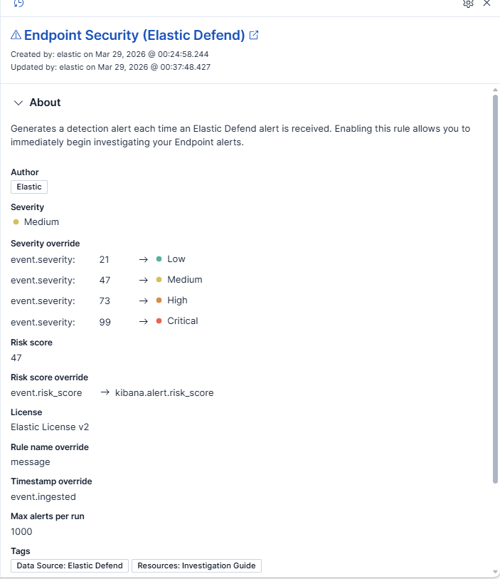
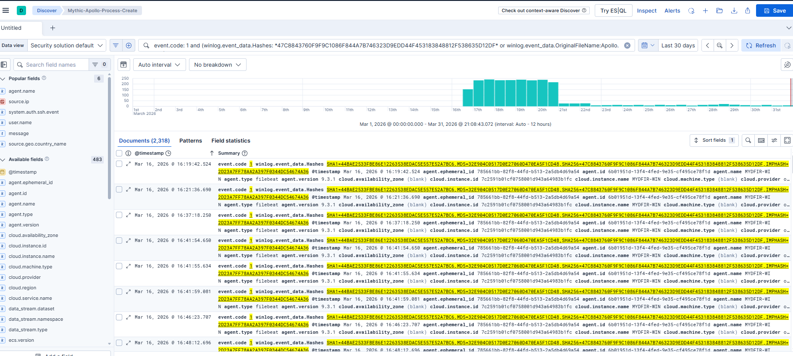
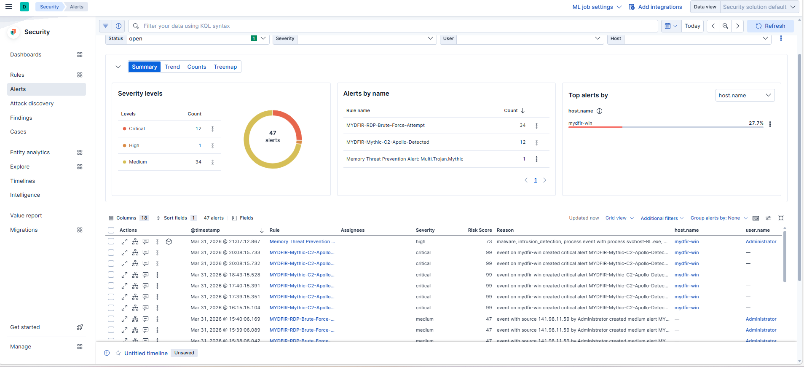
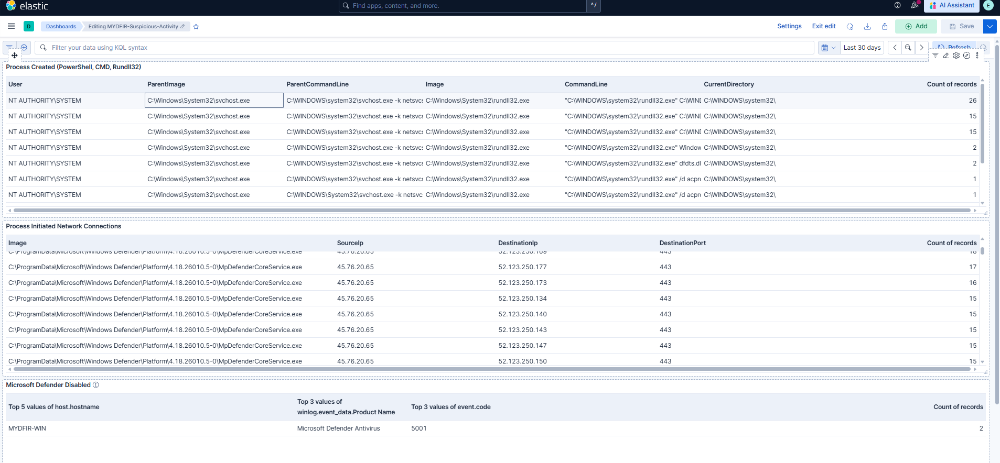
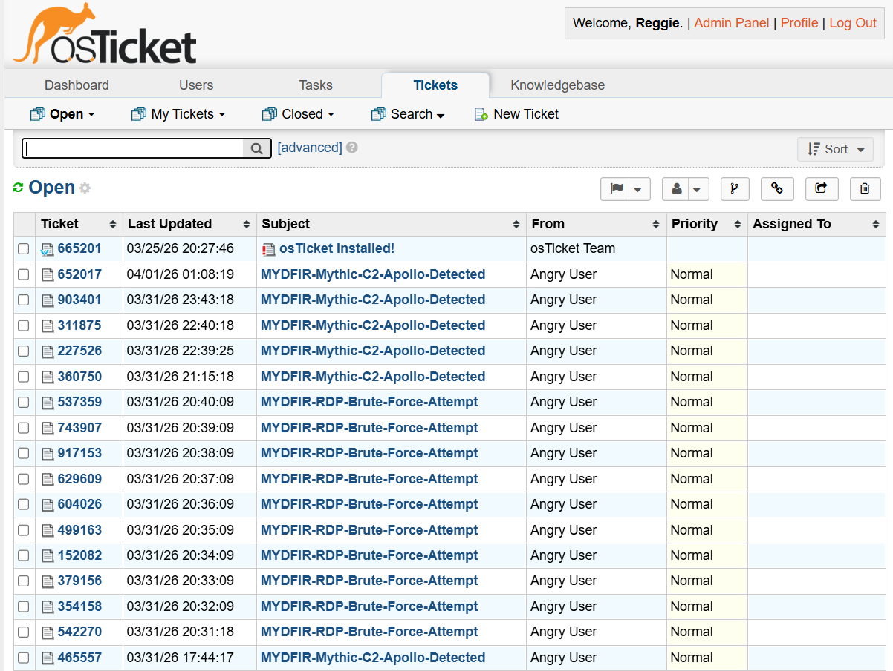
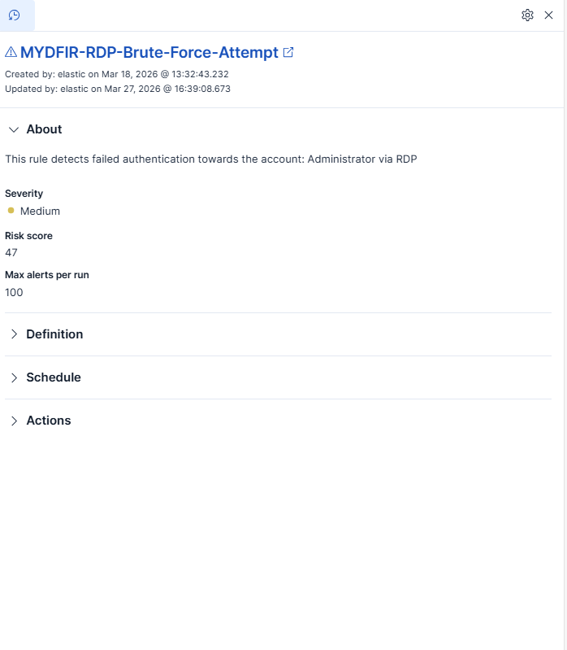

# SOC Lab – MYDFIR 30-Day Challenge

## Overview
This project demonstrates a fully built Security Operations Center (SOC) lab using ELK Stack for centralized logging, monitoring, and threat detection.

## Lab Environment
- Windows Server (RDP exposed)
- Ubuntu Server (SSH enabled)
- Elasticsearch, Kibana, Fleet Server
- Elastic Agent (endpoint telemetry)
- Sysmon (Windows logging)
- Mythic C2 framework
- osTicket (ticketing system)

## Key Skills Demonstrated
- SIEM deployment and configuration (ELK Stack)
- Endpoint telemetry collection (Sysmon, Elastic Agent)
- Detection engineering (custom alerts for brute force and C2)
- Incident response and investigation
- Dashboard creation and log analysis
- MITRE ATT&CK mapping

## Attack Simulations
- SSH brute force attack
- RDP brute force attack
- Command & Control (C2) using Mythic

## Detection & Monitoring
- Created alerts for brute force login attempts
- Built dashboards for authentication monitoring
- Detected C2 beaconing activity

## Incident Response
- Investigated SSH brute force attempts
- Investigated RDP authentication attacks
- Analyzed C2 telemetry and attacker behavior

## Screenshots & Evidence
## Screenshots & Evidence

This section contains visual evidence demonstrating detection engineering, threat hunting,
security monitoring, and incident response workflows implemented in the MYDFIR SOC lab.

---

### Elastic Endpoint Security Rule

This screenshot shows an Elastic Endpoint Security (Elastic Defend) rule configured to
generate alerts when suspicious or malicious endpoint activity is detected. It demonstrates
endpoint protection coverage, severity assignment, and risk scoring within Elastic Security.

---

### Threat Hunting – RDP Brute-Force Events

This screenshot displays the results of a threat hunt identifying multiple failed
authentication events consistent with an RDP brute-force attack. The highlighted log
entries show repeated failures over a short time window, indicating credential attack behavior.

---

### SIEM Alerts Overview Dashboard

This dashboard provides a high-level overview of active security alerts within Elastic SIEM.
It visualizes alert volume and severity distribution, enabling rapid triage and prioritization
by SOC analysts.

---

### Windows Authentication Log Analysis

This screenshot shows analysis of Windows authentication logs used to investigate failed
logon attempts. Fields such as usernames, source IP addresses, and timestamps are leveraged
to identify suspicious login patterns and confirm brute-force activity.

---

### Incident Ticket Creation (osTicket)

This screenshot demonstrates security alerts being ingested into osTicket, automatically
creating incidents for analyst review and response. It represents a real-world
detection-to-response workflow used in SOC environments.

---

### RDP Brute-Force Detection Rule Configuration

This screenshot shows the configuration of the custom Elastic SIEM detection rule
**MYDFIR-RDP-Brute-Force-Attempt**, designed to detect repeated failed RDP authentication
attempts against privileged accounts. It highlights rule tuning, severity selection,
and risk score configuration.

## Tools Used
- ELK Stack (Elasticsearch, Logstash, Kibana)
- Sysmon
- Elastic Agent & Fleet
- Mythic C2
- osTicket

## Outcome
This lab demonstrates hands-on experience in SOC operations, threat detection, and incident response using real-world tools and attack simulations.

